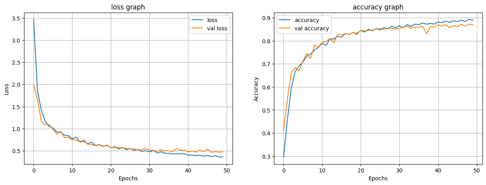
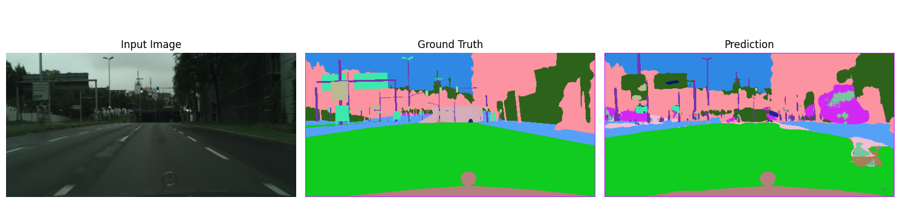
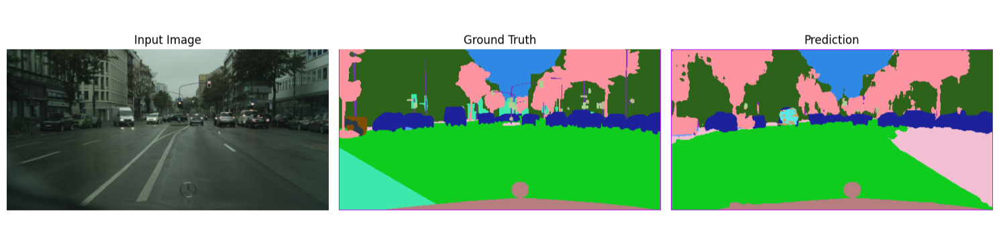

# Semantic Segmentation of [Cityscapes dataset from kaggle](https://www.kaggle.com/datasets/electraawais/cityscape-dataset/data?select=Fine+Annotations) 

Semantic Segmentation - assigning classes to each pixel of an image, without distinguishing between individual instances of the same type

#
### model architecture: U-net
* Model was chosen for it's proven reliability in semantic segmentation and it's accuracy

### Used anti-overfitting techniques:
* dropout - random neuron deactivation during training
* splitting data to training, validation and test dataset
* early stopping: monitoring val_loss if doesnt't improve for some epochs 
* applying penalties for too large weights

#
### Final results - without resnet pretraining

Final Test Loss:     0.4942

Final Test Accuracy: 86.76%

#
### Loss and accuracy graph 

#
### Examples

